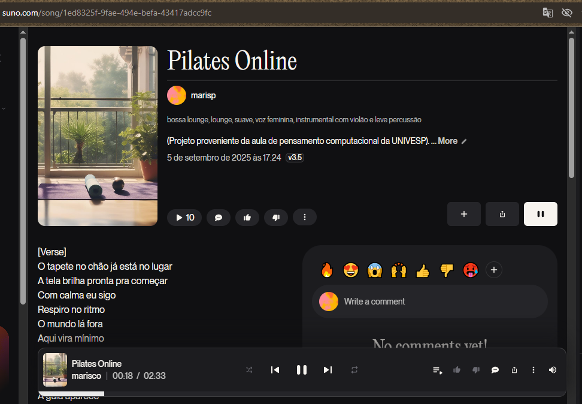
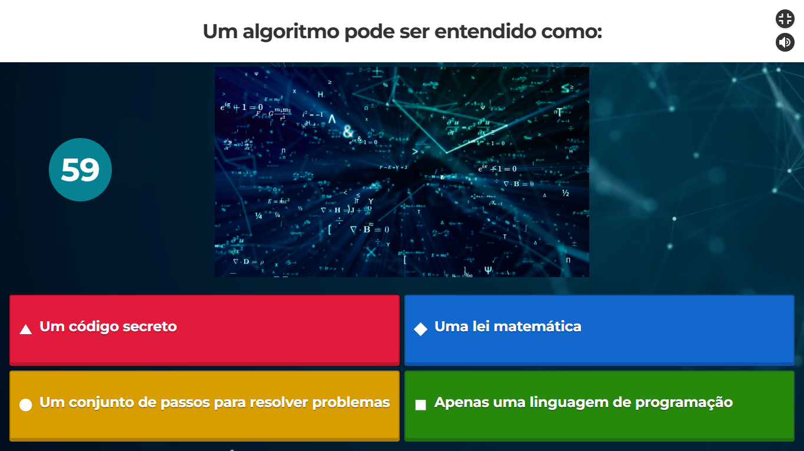
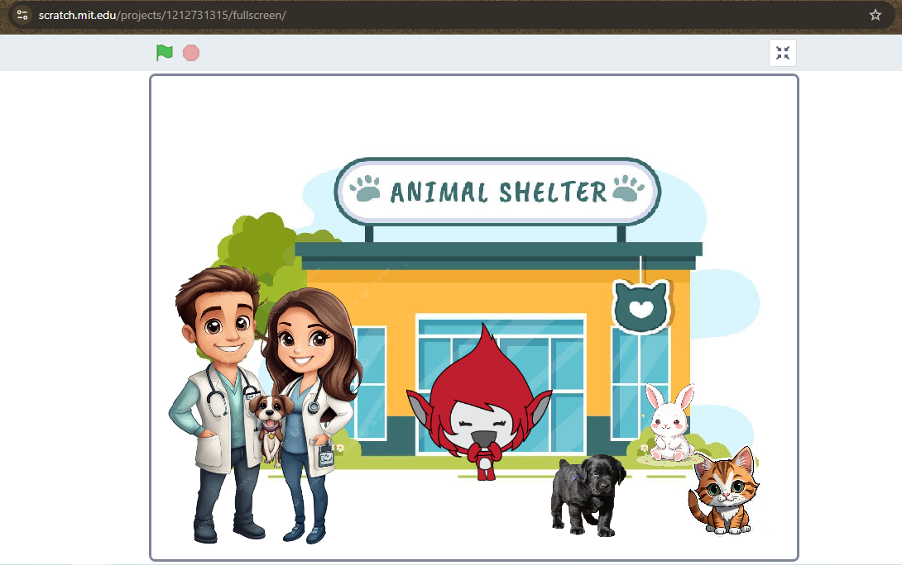
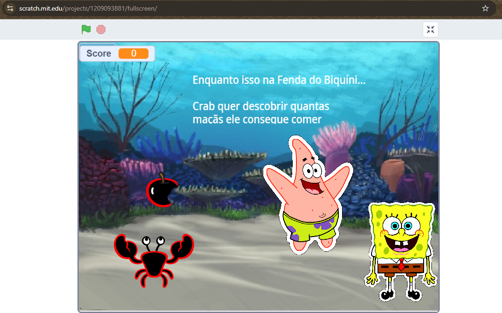
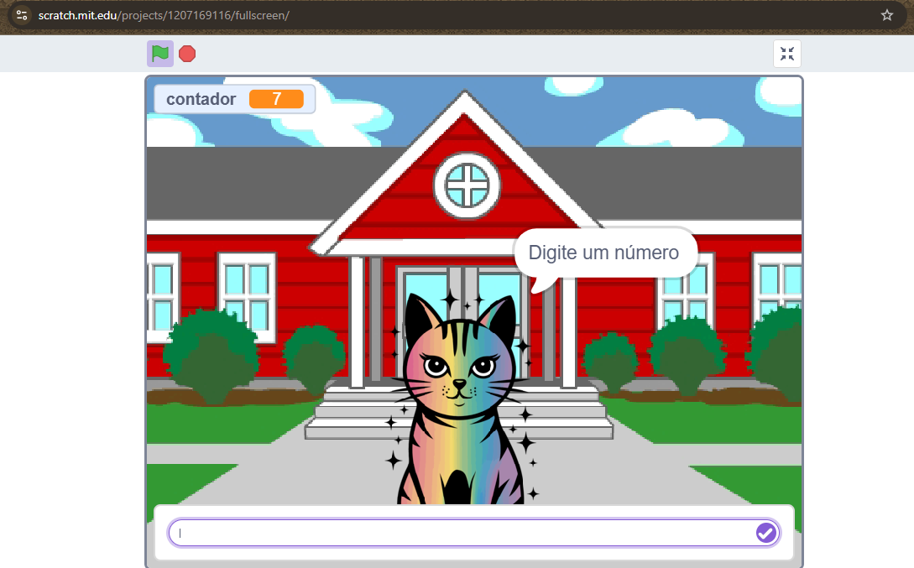
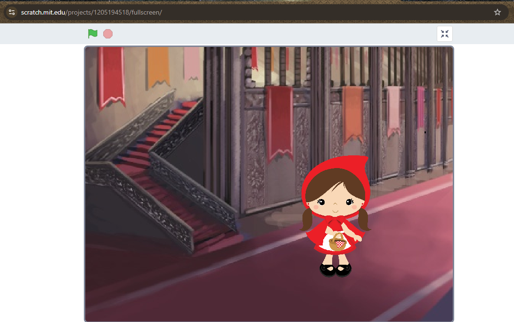

# Meus Projetos de Pensamento Computacional - Graduação Ciência de Dados - UNIVESP

Olá! Este repositório é dedicado a registrar minha jornada e evolução na disciplina de Pensamento Computacional do curso Ciência de Dados da UNIVESP durante o ano de 2025. Aqui você encontrará os projetos desenvolvidos, os desafios enfrentados e os conceitos que aprendi.

## 🚀 Projetos Desenvolvidos

---

### Semana 7: Projetos 05 e 06 – Música com IA (Suno) e Quiz com Kahoot!

#### Projeto 05 – Música-tema com Suno
Música criada com inteligência artificial para o estúdio de Pilates *Mova-se*.  
🎵 [Ouvir no Suno](https://suno.com/s/uqsWXnJ5ikgukZJS)

---

#### Projeto 06 – Quiz de Revisão com Kahoot!
Quiz interativo para revisão da semana de provas.  
👉 [Participar do Quiz](https://kahoot.it/challenge/08732145?challenge-id=ee08283e-7662-4230-98d1-87ece845483d_1757344067825) | **PIN:** 08732145  
⏳ Disponível até 18/09/2025 às 18h00  

---

### Semana 6: Projeto 04 Superpoderes - Teletransporte.

**Descrição:** A Grace usa o poder de teletransporte para resgatar animais em perigo e levá-los a um abrigo seguro. O clique do jogador no animal é o gatilho: a Grace se teletransporta com o bichinho, muda o cenário do perigo para o abrigo e avança a história.

**Conceitos aplicados:** Eventos de clique, transmitir/receber mensagens, troca de cenários, animação e lógica sequencial.

**Arquivo do projeto:** [projeto_superpoderes.sb3](./projeto_superpoderes.sb3)  
**Link no Scratch:** [https://scratch.mit.edu/projects/1212731315]

 

---

### Semana 5: Projeto 03 Remix de projeto personalizado de acordo com minhas idéias pessoais.
* **Descrição:** Este projeto é um remix de um jogo "apanhador de maçãs", transformado em uma cena cômica interativa com os personagens Bob Esponja e Patrick. A narrativa e o humor foram o foco principal, criando uma experiência única a partir de uma base simples.
* **Conceitos aplicados:** Aprendizagem Criativa (Remix), sincronização de múltiplos atores com o sistema de mensagens (`transmitir` e `receber`), animação de entrada, depuração de estado (resolvendo o problema de atores que não reapareciam) e design de som.
* **Arquivo do Projeto:** [`Remix_crab_bob_esponja.sb3`](./Semana_05_03_GrabBob_esponja/Remix_crab_bob_esponja.sb3)
* **Veja online no Scratch:** [https://scratch.mit.edu/projects/1209093881]

---

### Semana 4: Projeto 02 Gato Binário
* **Descrição:** Um jogo interativo onde o "Gato Binário" pede um número ao usuário. O programa utiliza condicionais para verificar se o número é menor que 10 e, em caso positivo, realiza uma contagem progressiva. O projeto inclui animações de entrada e de miado para tornar a experiência mais imersiva.
* **Conceitos aplicados:** Variáveis, estruturas condicionais (se/senão), laços de repetição, entrada e saída de dados, e animação com fantasias e movimento sincronizado.
* **Arquivo do Projeto:** [`projeto_gato_binario.sb3`](./Semana_04_02_GatoBinario/projeto_gato_binario.sb3)
* **Veja online no Scratch:** [https://scratch.mit.edu/projects/1207169116]

---

### Semana 3: Projeto 01 Chapeuzinho Vermelho
* **Descrição:** Uma pequena animação ou história interativa baseada no conto da Chapeuzinho Vermelho, meu primeiro contato com a lógica de animação e diálogo no Scratch.
* **Conceitos aplicados:** Sequência de comandos, controle de tempo, movimento de atores e diálogo.
* **Arquivo do Projeto:** [`projeto_chapeuzinho_vermelho.sb3`](./Semana_03_01_Chapeuzinho/projeto_chapeuzinho_vermelho.sb3)
* **Veja online no Scratch:** [https://scratch.mit.edu/projects/1205194518]

---
*Este repositório será atualizado conforme novos projetos forem desenvolvidos ao longo do curso.*
